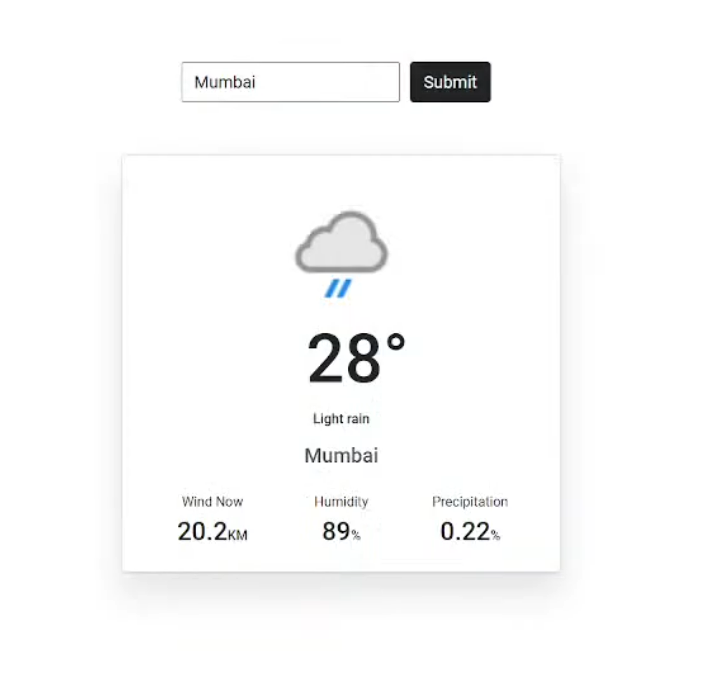
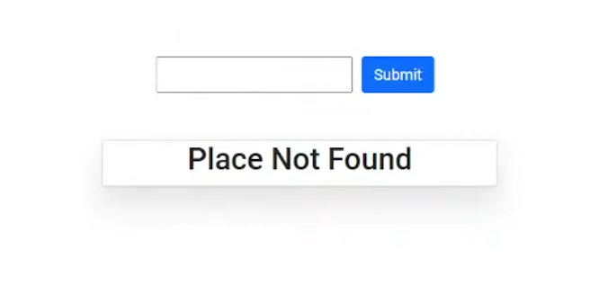
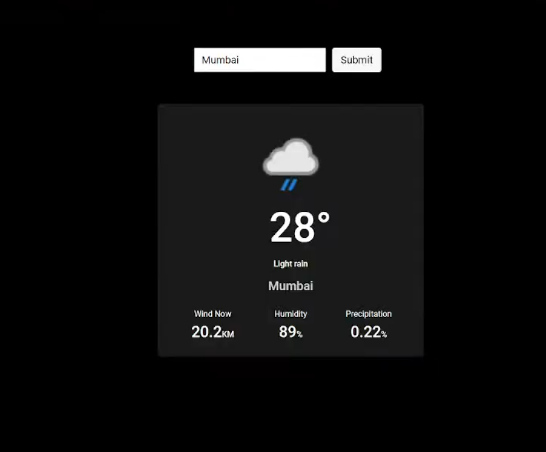

# Weather App

Weather App is a very useful application for everyone ,designed simple and easy to use.

Here is a react-app which shows the live weather condition of given place.
For example- Temperature, Wind Now, Humidity and Precipitation

In above image , I have searched the Weather Condition of Mumbai . On submitting the City Name , get this image as ouutput .

## Tech Stack Used
* React JS
* CSS
* Redux
* Bootstrap
* Weather API

In case the given city does not exist ,
then shows *Place  Not Found*
(above image for reference)

In above image, there is UI/UX in the dark mode of the react-app.

We can switch On/Off Dark Mode using side toggle button.
